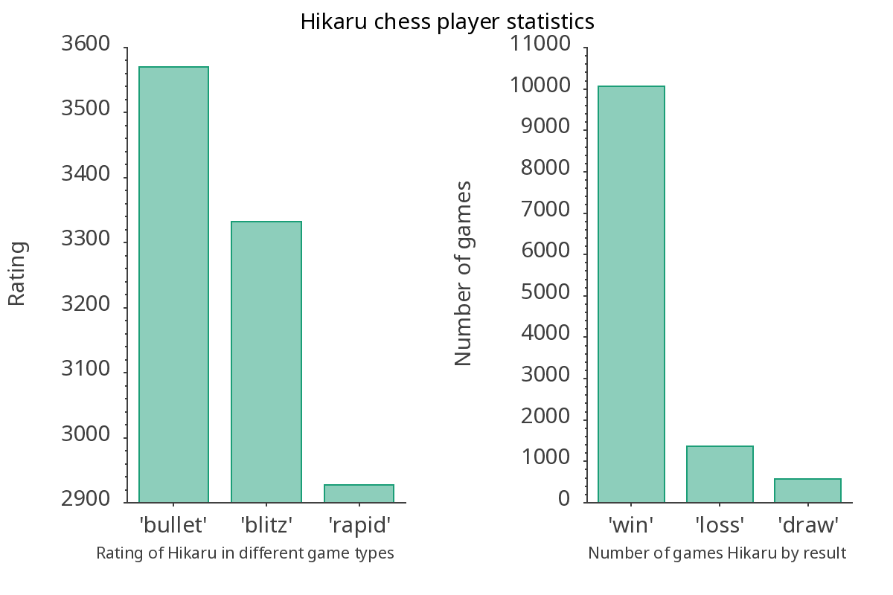
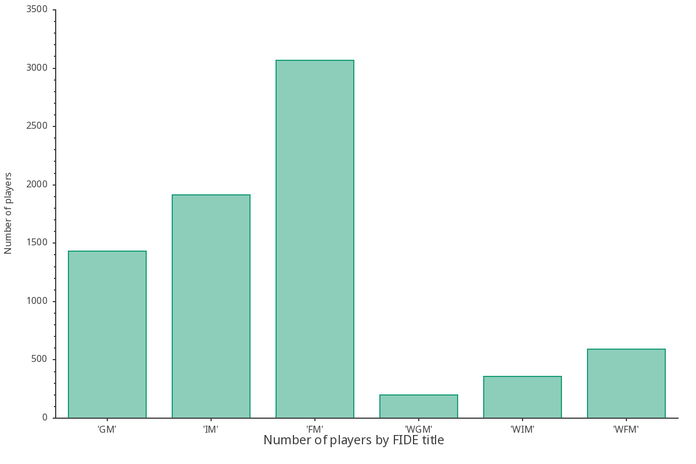
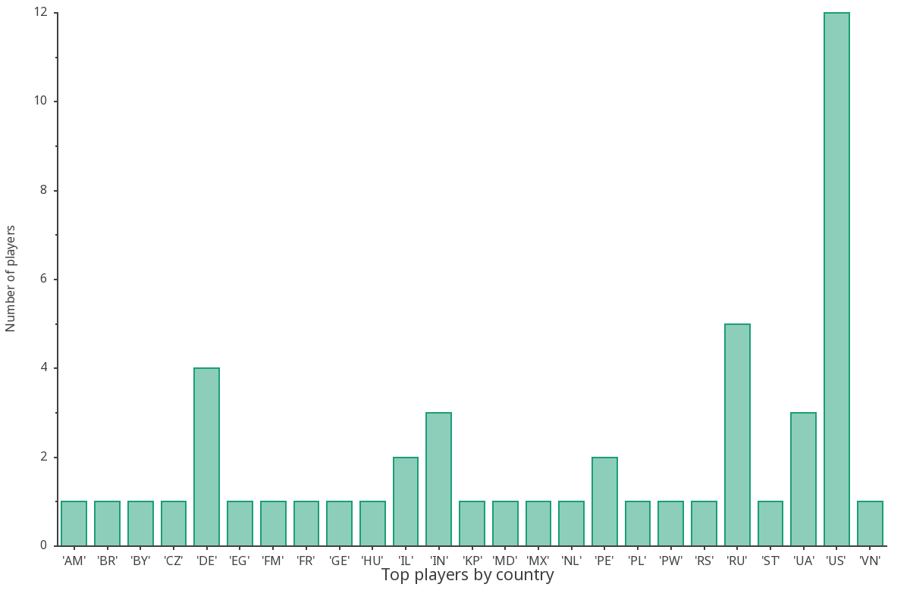

# visualAPI

## Mini-project realised as a part of AGH UST C++ course

### 1. Overview

visualAPI uses Chess.com public API to visualize some popular statistics available.
Presented data is accurate as it is downloaded at the moment you run your program. 
Plots and diagrams are generated using gnuplot and sciplot libraries.

### 2. Requirements

In order to run this program you need to have following libraries installed:

- libcurl
```sudo dnf install libcurl-devel``` (or equivalent for your system)
- gnuplot
```sudo dnf install gnuplot``` (or equivalent for your system)
- sciplot
  https://sciplot.github.io/installation/
- nlohmann_json https://json.nlohmann.me/integration/cmake/

### 3. Usage

Run cmake: ```cmake .```
Build and link libraries: ```make all```
Run program: ```./visualAPI```

### 4. Options

After running program you can use following options:

- Press 0 to exit program.
- Press 1 to see best server player statistics.
- Press 2 to see 50 best server players.
- Press 3 to check stats of chosen player (You can choose player by typing his name).
- Press 4 to see 50 best players of Chess.com server.

Every option except 0 and 3 will also generate plots to /plots subdirectory.

In detail, each option has 4 stages:

1. Downloading data from Chess.com API, using libcurl.
2. Operations of json files to extract information interesting to us.
3. Generating plots using gnuplot and sciplot.
4. Saving plots to /plots subdirectory.

### 5. Example plots generated with program






